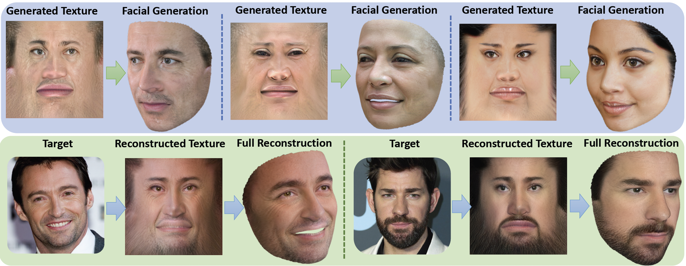

**Unsupervised High-Fidelity Facial Texture Generation and Reconstruction**<br>
Ron Slossberg, Ibrahim Jubran, Ron Kimmel<br>
https://arxiv.org/abs/2110.04760<br>
European Conference on Computer Vision (ECCV) 2022 <br>

Abstract: Many methods have been proposed over the years to tackle the task of facial 3D geometry and texture recovery from a single image.
Such methods often fail to provide high-fidelity texture without relying on 3D facial scans during training.
In contrast, the complementary task of 3D facial generation has not received as much attention.
As opposed to the 2D texture domain, where GANs have proven to produce highly realistic facial images, the more challenging 3D domain has not yet caught up to the same levels of realism and diversity.

In this paper, we propose a novel unified pipeline for both tasks, generation of texture with coupled geometry, and reconstruction of high-fidelity texture. Our texture model is learned, in an unsupervised fashion, from natural images as opposed to scanned textures.
To our knowledge, this is the first such unified framework independent of scanned textures.

Our novel training pipeline incorporates a pre-trained 2D facial generator coupled with a deep feature manipulation methodology.
By applying our two-step geometry fitting process, we seamlessly integrate our modeled textures into synthetically generated background images forming a realistic composition of our textured model with background, hair, teeth, and body.
This enables us to apply transfer learning from the 2D image domain, thus leveraging the high-quality results obtained in this domain.

We provide a comprehensive study on several recent methods comparing our model in generation and reconstruction tasks.
As the extensive qualitative, as well as quantitative analysis, demonstrate, we achieve state-of-the-art results for both tasks.


## Result Summary

The main contributions of our work are as follows:
* (i) We provide the first unsupervised high-fidelity generation pipeline capable of producing realistic textures coupled with corresponding geometries.
This is achieved by a novel training pipeline which successfully decouples intrinsic texture features related to the person's identity, from extrinsic properties such as pose and Lambertian illumination.
* (ii) In addition to texture generation, we utilize the very same model for the task of texture recovery from a single image, successfully reconstructing frontal as well as peripheral facial details.
* (iii) We present state-of-the-art results in both model generation as well as full texture recovery.
We support this claim via both qualitative as well as quantitative results and comparisons; see example results below and in the paper. An additional demonstration video is available [here](https://youtu.be/sm8xWxvAL9s}{https://youtu.be/sm8xWxvAL9s).
* (iv) Our results are fully reproducible as only freely available datasets and models are required during training and inference. In addition, we provide all our pre-trained model weights for both generation and reconstruction tasks.

## Example Results

* **Reconstruction results using a known benchmark:** The following figure presents texture reconstruction results on the MOFA test-set, as compared to previous methods.


* **Reconstruction results from high resolution random images:** The following figure presents texture reconstruction results on higher resolution images.


* **Reconstruction of side-view images:** In the following figure we demonstrate reconstruction results under various side-view conditions. We first estimate the head pose for samples of the FFHQ dataset and reconstruct several samples with head rotation from $20$ up to above $50$ degrees of rotation. We note that upwards of $99\%$ of the dataset is within the range of $[-50,50]$ degrees. We find that even when the face is highly rotated, the unobserved side of the face is reasonable completed in a realistic manner due to our learned facial model.


* **Full texture and corresponding geometry generation:** In the following figure we visually compare our output textures and rendered textured geometries to previous methods. Our high resolution textures provide highly realistic faces spanning a wide variety of ages, ethnicity and appearance.
The leftmost column provides a zoomed-in crop, highlighting the high resolution details.
The proposed method presents finer details and realism as compared to both previous methods, even though one of the competing methods is supervised by scanned textures.


Trained generator weights can be downloaded from [Google Drive.](https://drive.google.com/file/d/1ImhegcP622fVOBteNeeq9B9Li_qYpAjZ/view?usp=sharing)

**Additional details, results, and ablation study are provided within our paper.**

## Citation

Our repo is based on [StyleGAN2-ADA](https://github.com/NVlabs/stylegan2-ada-pytorch). Please cite

```
@inproceedings{Karras2020ada,
  title     = {Training Generative Adversarial Networks with Limited Data},
  author    = {Tero Karras and Miika Aittala and Janne Hellsten and Samuli Laine and Jaakko Lehtinen and Timo Aila},
  booktitle = {Proc. NeurIPS},
  year      = {2020}
}
```

```
@article{slossberg2021unsupervised,
  title={Unsupervised High-Fidelity Facial Texture Generation and Reconstruction},
  author={Slossberg, Ron and Jubran, Ibrahim and Kimmel, Ron},
  journal={arXiv preprint arXiv:2110.04760},
  year={2021}
}
```
